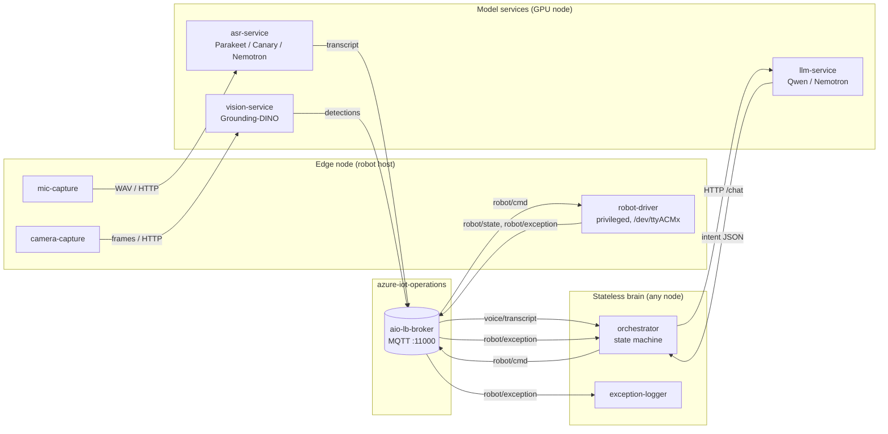
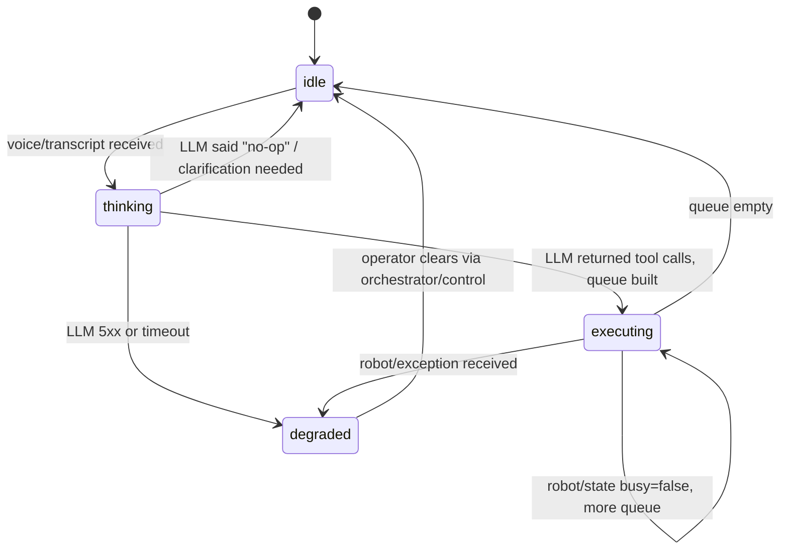

# cobotpoc — Kubernetes-native architecture

> Portable, multi-container redesign of [`cobotpoc.py`](../cobotpoc/cobotpoc.py).
> Goal: deploy on **any Linux machine with a Kubernetes cluster** (k3s, kind, AKS,
> EKS, etc.), with model serving on a GPU node, hardware adapters pinned to the
> robot host, and a stateless brain that anyone can restart.
>
> Models in scope: **Qwen** (LLM) and **Nemotron** (replaces Parakeet — see §0
> for the open question on speech vs language).

---

## 0. Open question — what does "Nemotron replaces Parakeet" mean?

NVIDIA NeMo names overlap. Two readings:

| Reading | Meaning | Effect on this design |
|---|---|---|
| **A** | Replace Parakeet (ASR) with another ASR (Canary, etc.); add Nemotron as a second LLM next to Qwen | Two model slots: `asr-service` (any ASR), `llm-service` (Qwen *or* Nemotron) |
| **B** | "Nemotron" literally serves speech-to-text | Single ASR slot powered by Nemotron-Speech / NeMo-Canary |

Architecture is identical for both: ASR and LLM are **swappable HTTP services
behind a stable contract**. Only the chosen image changes.

---

## 1. Target architecture



Key shapes:

- **MQTT is the only cross-component bus.** Pure model HTTP for stateless
  inference (mic→ASR, orchestrator→LLM, camera→vision); everything else flows
  through the broker. Any component can be moved to any node, any cluster, as
  long as it can reach the broker.
- **Stateless brain.** The orchestrator holds no state that can't be rebuilt
  from topic streams. Restart-safe.
- **Model-agnostic services.** Both `asr-service` and `llm-service` expose
  OpenAI-compatible endpoints (`/v1/audio/transcriptions`,
  `/v1/chat/completions`). Swapping Parakeet → Nemotron or Qwen → Nemotron is a
  Deployment image change with **no orchestrator change**.

---

## 2. Containers (8 runtime, 1 sample, 1 broker)

### Model services — `cobotpoc-models` namespace, GPU node

| # | Container | Replaces / extends | Image base | GPU? | Privileged |
|---|---|---|---|---|---|
| 1 | **`asr-service`** | existing `parakeet-gpu` Deployment (or its Nemotron-Speech / Canary swap) | NeMo / Triton / HF inference server | yes | no |
| 2 | **`llm-service`** | existing Qwen Deployment | vLLM or TGI | yes | no |
| 3 | **`vision-service`** | inline `lookForCube/Bowl/Hand/Misc` in [`cobotpoc.py`](../cobotpoc/cobotpoc.py) (lines 241-912) | FastAPI + Grounding-DINO (or NV-DINO) | yes | no |

### Edge / hardware adapters — `cobotpoc-edge` namespace, pinned to host

| # | Container | Replaces | Hardware access | Node label |
|---|---|---|---|---|
| 4 | **`mic-capture`** | mic + speech-callback block in [`cobotpoc.py`](../cobotpoc/cobotpoc.py) (lines 67-202) | `hostPath /dev/snd`, `audio` group | `cobotpoc.io/audio=true` |
| 5 | **`camera-capture`** | camera enumeration / frame grab block (lines 207-240) | `hostPath /dev/video0` | `cobotpoc.io/camera=true` |
| 6 | **`robot-driver`** | [`test_robot.py`](../cobotpoc/container-images/robot/test_robot.py) + motion code in [`cobotpoc.py`](../cobotpoc/cobotpoc.py) (lines 1057-1264) | **`privileged: true`**, `hostPath /dev/ttyACMx` | `cobotpoc.io/role=robot` |

### App logic — `cobotpoc-app` namespace, anywhere

| # | Container | Role |
|---|---|---|
| 7 | **`orchestrator`** | The brain. Subscribes to `voice/transcript` + `vision/detection`, calls `llm-service`, plans, publishes `robot/cmd`. Replaces `interpretWithLLM` + main loop in [`cobotpoc.py`](../cobotpoc/cobotpoc.py) (lines 917, 1380). |
| 8 | **`exception-logger`** | Subscribes to `robot/exception` + `system/exception`, persists them (file/PVC, optionally Loki). The publishers use the shared `common/telemetry.py` helper — this container is the consumer. |

### Reused as-is

| Container | Status |
|---|---|
| `mqtt-publisher` ([`container-images/mqtt-publisher/`](../cobotpoc/container-images/mqtt-publisher/)) | Stays as the canonical paho-mqtt sample / smoke-test. Not a runtime component. |
| `aio-lb-broker` (in `azure-iot-operations`) | Already deployed, untouched. Plaintext anonymous MQTT on port `11000`. |

**Total runtime containers: 8** (5 new, 3 already deployed/in-progress).

### Co-location summary

- **GPU node** (1 of): `asr-service`, `llm-service`, `vision-service`
- **Robot host** (1 of): `mic-capture`, `camera-capture`, `robot-driver`
- **Anywhere**: `orchestrator`, `exception-logger`

---

## 3. MQTT topic plan

Single source of truth for inter-component messaging. All on the existing
`aio-lb-broker`. The `{tenant}` segment lets the same charts run on multiple
clusters/labs without collision.

| Topic | Producer | Consumer | QoS | Retain | Payload (JSON) |
|---|---|---|---|---|---|
| `cobotpoc/{tenant}/voice/transcript` | mic-capture / asr-service | orchestrator | 1 | no | `{ts, source_id, text, latency_ms, confidence}` |
| `cobotpoc/{tenant}/vision/detection` | camera-capture / vision-service | orchestrator | 1 | no | `{ts, frame_id, target, bbox, score, world_xyz}` |
| `cobotpoc/{tenant}/robot/cmd` | orchestrator | robot-driver | 1 | no | `{ts, cmd_id, kind, joints?, pose?, speed, deadline_ms, issued_by}` |
| `cobotpoc/{tenant}/robot/state` | robot-driver | orchestrator, exception-logger | 0 | no | `{ts, cmd_id?, joints, busy, last_error?}` |
| `cobotpoc/{tenant}/robot/exception` | robot-driver | orchestrator, exception-logger | **1** | no | see §4 |
| `cobotpoc/{tenant}/system/exception` | any | exception-logger, orchestrator | 1 | no | see §4 |
| `cobotpoc/{tenant}/system/heartbeat` | every component | exception-logger, orchestrator | 0 | yes | `{ts, component, version, host}` |
| `cobotpoc/{tenant}/orchestrator/status` | orchestrator | UIs / dashboards | 0 | **yes** | `{ts, state, last_cmd_id, queue_depth}` |
| `cobotpoc/{tenant}/orchestrator/control` | operators | orchestrator | 1 | no | `{action: pause/resume/abort}` |

QoS / retain rules:

- **QoS 1** for anything where loss is bad (commands, exceptions, transcripts).
- **QoS 0** for high-rate streams (state, detections, heartbeats) — re-emitted
  often enough that loss is OK.
- **`retain: true`** only on `orchestrator/status` and `system/heartbeat`, so a
  freshly-started UI knows the current brain state and which components are
  alive on connect. **Never retain on `robot/cmd`** — you'd re-execute on
  restart.

---

## 4. Exception capture — small reusable library

One shared module so any component (driver, vision, mic, ASR client,
orchestrator) publishes exceptions consistently.

```python
# cobotpoc/common/telemetry.py  (new, ~40 lines, in a tiny shared image layer)
import json, os, socket, time, traceback, uuid
import paho.mqtt.client as mqtt

_BROKER = os.environ["MQTT_BROKER"]          # injected via ConfigMap
_PORT   = int(os.environ.get("MQTT_PORT", "11000"))
_TENANT = os.environ.get("TENANT", "default")
_COMP   = os.environ["COMPONENT"]            # set per Deployment

_client = mqtt.Client(
    callback_api_version=mqtt.CallbackAPIVersion.VERSION2,
    client_id=f"{_COMP}-{socket.gethostname()}-{uuid.uuid4().hex[:6]}",
)
_client.connect(_BROKER, _PORT, 30)
_client.loop_start()

def reportException(exc: BaseException, *, cmd_id=None, **context):
    payload = {
        "ts": time.time(),
        "component": _COMP,
        "host": socket.gethostname(),
        "cmd_id": cmd_id,
        "exception_type": type(exc).__name__,
        "message": str(exc),
        "traceback": traceback.format_exc(),
        "context": context,
    }
    topic = (
        f"cobotpoc/{_TENANT}/robot/exception"
        if _COMP == "robot-driver"
        else f"cobotpoc/{_TENANT}/system/exception"
    )
    _client.publish(topic, json.dumps(payload), qos=1, retain=False)
```

In `robot-driver`, every motion call is wrapped:

```python
try:
    self.cobot.send_angles(angles, speed)
except Exception as e:
    reportException(e, cmd_id=cmd.id, kind=cmd.kind, joints=angles, speed=speed)
    raise   # let the driver decide whether to recover, requeue, or stop
```

The orchestrator subscribes to `robot/exception` so it can react (cancel queue,
ask user to confirm, switch to a degraded mode). The `exception-logger` is a
separate subscriber whose only job is durable record-keeping (file PVC, Loki,
etc.) — optional but makes ops visible.

---

## 5. Orchestrator MQTT contract (in detail)

The orchestrator is the only component that touches every topic — every other
container is either a pure producer or a pure consumer.

### 5a. Subscriptions

```python
client.subscribe([
    (f"cobotpoc/{TENANT}/voice/transcript",     1),
    (f"cobotpoc/{TENANT}/vision/detection",     1),
    (f"cobotpoc/{TENANT}/robot/state",          0),
    (f"cobotpoc/{TENANT}/robot/exception",      1),
    (f"cobotpoc/{TENANT}/system/heartbeat",     0),
    (f"cobotpoc/{TENANT}/orchestrator/control", 1),   # ops "pause/resume" channel
])
```

| Topic | Why orchestrator cares | What it does on each message |
|---|---|---|
| `voice/transcript` | New user utterance | Validate text → call `llm-service` → translate the model's tool-call JSON into `robot/cmd` messages |
| `vision/detection` | Latest known position of named objects | Cache the most recent detection per `target` in memory; the LLM step reads from this cache |
| `robot/state` | Driver busy / idle / at angles X | Track `busy` flag; gate command pacing |
| `robot/exception` | A motion command failed | Cancel rest of planned queue, mark failed `cmd_id`, optionally re-prompt |
| `system/heartbeat` | Liveness from mic, camera, driver, models | If a critical component goes silent for >N s, refuse to publish `robot/cmd` and emit `system/exception` |
| `orchestrator/control` | Operator pause/resume/abort | Transition state machine accordingly |

### 5b. Publishes

| Topic | QoS | Retain | When | Payload |
|---|---|---|---|---|
| `robot/cmd` | 1 | no | LLM produced a tool call | one msg per atomic motion step |
| `system/exception` | 1 | no | LLM failure, ASR garbage, no detection found, etc. | same shape as §4 |
| `system/heartbeat` | 0 | yes | every 5 s | `{ts, component:"orchestrator", version, host}` |
| `orchestrator/status` | 0 | **yes** | on state transitions | `{ts, state, last_cmd_id, queue_depth}` |

### 5c. `cmd_id` ties everything together

Orchestrator generates a **ULID** for every command and threads it through:

```text
orchestrator publishes:  robot/cmd          {cmd_id: A, joints: [...]}
robot-driver echoes:     robot/state        {cmd_id: A, busy: true}
                         robot/state        {cmd_id: A, busy: false}      // success
                or:      robot/exception    {cmd_id: A, exception: ...}   // failure
```

This gives the orchestrator three things for free:

1. **Correlation** — knows which exception belongs to which command (and which
   user utterance).
2. **Idempotency** — if the driver sees the same `cmd_id` twice (broker
   redelivery, orchestrator restart with QoS 1), it replies with cached state
   instead of re-executing.
3. **Cancel** — a future `robot/cmd` with `kind: "cancel", target_cmd_id: A` is
   unambiguous.

### 5d. Orchestrator state machine



Every transition publishes a retained message on `orchestrator/status`, so a
dashboard or `mosquitto_sub -t cobotpoc/+/orchestrator/status` always shows
the current brain state.

### 5e. Failure semantics

| Event | Orchestrator behavior |
|---|---|
| Broker disconnect | `loop_start()` auto-reconnect; on reconnect, re-subscribe; retained `orchestrator/status: degraded` already on broker for late joiners |
| QoS 1 redeliver of `voice/transcript` | dedupe by hashing `(source_id, ts, text)` over a 30 s window |
| LLM service 5xx | one retry with backoff, then `system/exception`, then `state: degraded` |
| `robot/exception` while queue non-empty | drop the rest of the queue, do **not** keep firing commands; require `orchestrator/control: resume` |
| No `robot/state` for >2 s after `robot/cmd` | publish `system/exception` "driver silent", transition to `degraded` |

---

## 6. Payload schemas

Validated on ingest and emitted on publish. Anything else is rejected and
turns into `system/exception` so contract violations are visible on the bus.

### 6a. `voice/transcript`
```json
{
  "ts": 1746480123.42,
  "source_id": "mic-capture-host42",
  "text": "pick up the red cube",
  "latency_ms": 412,
  "confidence": 0.93
}
```

### 6b. `vision/detection`
```json
{
  "ts": 1746480123.50,
  "frame_id": "cam0:182311",
  "target": "red cube",
  "bbox": [120, 240, 188, 320],
  "score": 0.87,
  "world_xyz": [0.21, -0.05, 0.04]
}
```

### 6c. `robot/cmd`
```json
{
  "ts": 1746480123.61,
  "cmd_id": "01HX9N2K5C7E3R9YKQ7BMQS1ZD",
  "kind": "send_angles",
  "joints": [0, -10, 30, 0, 90, 0],
  "speed": 30,
  "deadline_ms": 5000,
  "issued_by": "orchestrator"
}
```

`kind` ∈ `{send_angles, send_coords, gripper, wait, cancel}`.

### 6d. `robot/state`
```json
{
  "ts": 1746480123.80,
  "cmd_id": "01HX9N2K5C7E3R9YKQ7BMQS1ZD",
  "joints": [0, -10, 30, 0, 90, 0],
  "busy": true,
  "last_error": null
}
```

### 6e. `robot/exception` and `system/exception`

Identical shape — only the topic differs (so the exception-logger filters
"robot vs everything else" with one wildcard subscribe).

```json
{
  "ts": 1746480123.95,
  "component": "robot-driver",
  "host": "lenovo-k3s-cluster",
  "cmd_id": "01HX9N2K5C7E3R9YKQ7BMQS1ZD",
  "exception_type": "SerialException",
  "message": "could not open port /dev/ttyACM0",
  "traceback": "Traceback (most recent call last):\n  ...",
  "context": {"kind": "send_angles", "joints": [0, -10, 30, 0, 90, 0], "speed": 30}
}
```

---

## 7. Kubernetes layout (portability rules)

This is what makes "deploy on any Linux machine with a Kubernetes cluster"
actually true.

### 7a. Namespaces

| Namespace | Contents |
|---|---|
| `cobotpoc-models` | asr, llm, vision (heavy, GPU) |
| `cobotpoc-edge` | mic, camera, robot-driver (host-bound) |
| `cobotpoc-app` | orchestrator, exception-logger (anywhere) |
| `azure-iot-operations` | broker (existing, untouched) |

### 7b. Node-role labels

Administrator labels nodes once; charts target labels.

| Label | Meaning |
|---|---|
| `cobotpoc.io/role=gpu` | has NVIDIA driver + runtime, hosts model pods |
| `cobotpoc.io/role=robot` | has the robot's USB serial; gets `robot-driver` |
| `cobotpoc.io/audio=true` | has the mic; gets `mic-capture` |
| `cobotpoc.io/camera=true` | has the camera; gets `camera-capture` |

A new lab is brought up with:

```bash
kubectl label node <gpu-node>   cobotpoc.io/role=gpu
kubectl label node <robot-node> cobotpoc.io/role=robot \
                                cobotpoc.io/audio=true \
                                cobotpoc.io/camera=true
helm install cobotpoc ./charts/cobotpoc --set tenant=lab1
```

### 7c. ConfigMap-only configuration

One ConfigMap per env, defining:

- `MQTT_BROKER`, `MQTT_PORT`, `TENANT`
- `ASR_ENDPOINT`, `LLM_ENDPOINT`, `VISION_ENDPOINT` — all in-cluster service
  DNS, e.g. `http://asr-service.cobotpoc-models.svc.cluster.local:8000`

**No IPs, no hostnames specific to this cluster.** This is the single biggest
fix vs the current host-mode `cobotpoc.py` that hard-codes `192.168.1.197`
and `parakeet-gpu.local`.

### 7d. Hardware access patterns

| Resource | Pattern |
|---|---|
| USB serial (`/dev/ttyACMx`) | `privileged: true` + `hostPath` (validated, see [`robot_job.yaml`](../cobotpoc/kubernetes_yamls/robot_yamls/robot_job.yaml)) |
| Audio (`/dev/snd`) | `hostPath` + add user to `audio` group in image, no privileged |
| Video (`/dev/video0`) | `hostPath`, no privileged |
| GPU | `runtimeClassName: nvidia` + `NVIDIA_VISIBLE_DEVICES=all` (CDI-bug workaround) |

### 7e. Packaging

One Helm chart `charts/cobotpoc/` with sub-charts per component, plus a
top-level `values.yaml` that picks model images. This is the
"deploy anywhere" knob.

---

## 8. Refactor migration plan for `cobotpoc.py`

Strict rule during refactor: **don't rewrite, just relocate**. Each step is
mergeable on its own.

| Step | What moves | Where | Status |
|---|---|---|---|
| 1 | `transcribeSpeech*` body — already POSTs WAV to Parakeet | extract `mic-capture/main.py`, drop `sounddevice` deps elsewhere | service exists; container is new |
| 2 | `interpretWithLLM` (line 917) | `orchestrator/llm_client.py` (HTTP only, no model loaded locally) | endpoint exists |
| 3 | `lookForCube/Bowl/Hand/Misc` + `getTargetCoordsFromVision` (lines 241-912) | new `vision-service` (FastAPI: `/detect?target=...`); orchestrator calls it | needs containerization |
| 4 | `robotPlanMovementQueue` + `robotControllerTick` (lines 1057-1264) | `robot-driver/main.py`, MQTT-driven, replaces today's Job | base image exists at [`container-images/robot/`](../cobotpoc/container-images/robot/) |
| 5 | Main loop (line 1380) | `orchestrator/main.py` — subscribes to `voice/transcript`, calls LLM, publishes `robot/cmd` | new |
| 6 | `printVerbosely` / `suppressStdOut` (lines 29, 49) | `cobotpoc/common/logging.py` — keep them, useful in every container | trivial move |
| 7 | Add `reportException` (§4) wrapper around every `try` already in the file | each container imports the same `common/telemetry.py` | new |
| 8 | Replace top-level `cobotpoc.py` with a tiny **dev-mode launcher** that runs everything via `docker compose` for laptops without k3s | `dev/docker-compose.yml` | optional but valuable for demos |

After step 4, `cobotpoc.py` is gone and the host runs nothing except `kubectl`
access — exactly the portability goal.

---

## 9. Proposed repo layout

```
cobotpoc/
├── common/
│   ├── telemetry.py          # reportException, MQTT helper
│   └── logging.py            # printVerbosely, suppressStdOut
├── container-images/
│   ├── mqtt-publisher/        # already exists — canonical paho example
│   ├── robot/                 # already exists — extend with MQTT loop
│   ├── orchestrator/          # NEW
│   ├── mic-capture/           # NEW
│   ├── camera-capture/        # NEW
│   ├── vision-service/        # NEW (Grounding-DINO REST)
│   └── exception-logger/      # NEW
├── charts/
│   └── cobotpoc/              # umbrella Helm chart
│       ├── Chart.yaml
│       ├── values.yaml        # model image refs, tenant, broker addr
│       └── templates/         # one .yaml per Deployment, plus ConfigMap
├── kubernetes_yamls/          # already exists — keep raw manifests for ad-hoc deploys
└── dev/
    └── docker-compose.yml     # local dev w/o k3s
```

---

## 10. Open decisions

1. **Reading A or B for "Nemotron"?** (§0) Need this to pick the model image
   for one Deployment.
2. **Exception destination** — just MQTT, or also write to a PVC for offline
   review? (Default: MQTT-only; add file-sink later.)
3. **Vision service** — keep Grounding-DINO, or switch to NVIDIA NV-DINO /
   OWL-ViT for consistency with the NeMo/Nemotron stack?
4. **Multi-robot today, or single-robot?** `{tenant}` + `leader_id` on every
   payload makes multi-robot trivial later, but if not needed now I'll keep
   one driver replica.
5. **Helm vs Kustomize.** Helm gives `--set` overrides which suits "any Linux
   machine"; Kustomize is friendlier if you live in `kubectl apply -k`.
   Default: Helm.

Once those are answered, the recommended starting points are **`robot-driver`**
(unblocks the exception-logging requirement immediately) and the shared
**`common/telemetry.py`** (lets every other component publish exceptions
consistently). Together they prove the bus end-to-end before the orchestrator
lands.
